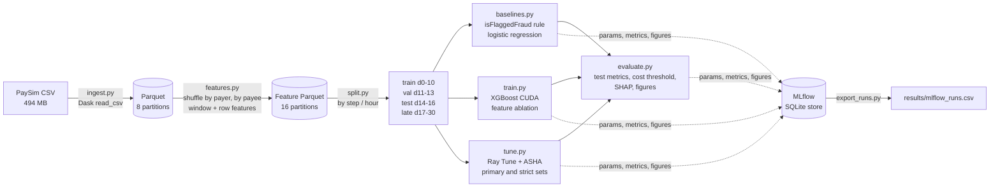
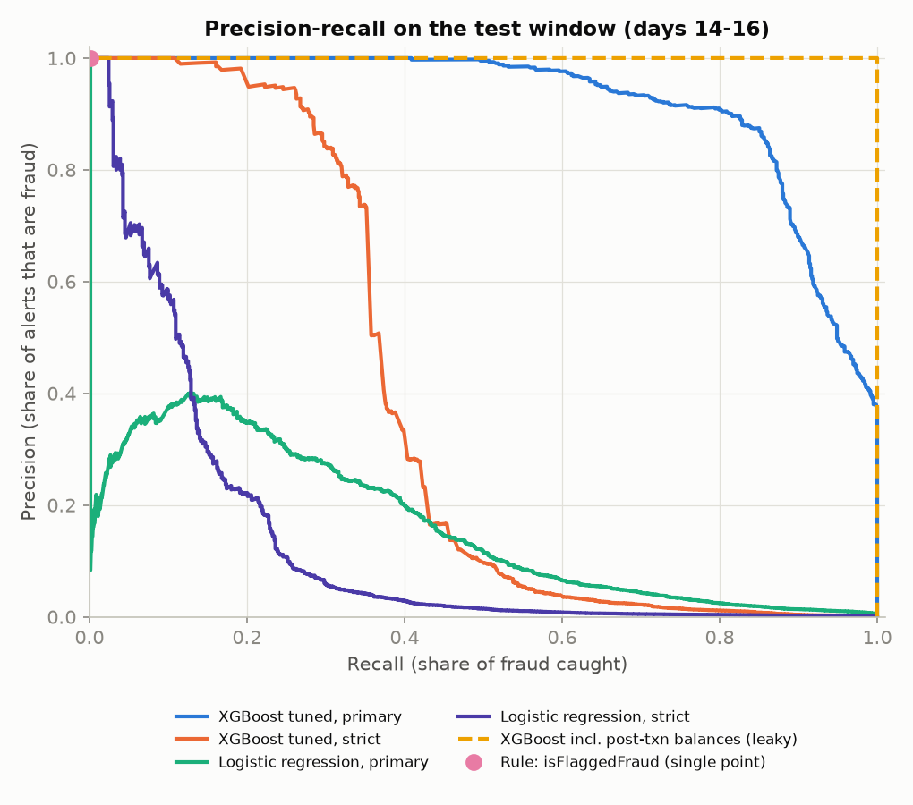
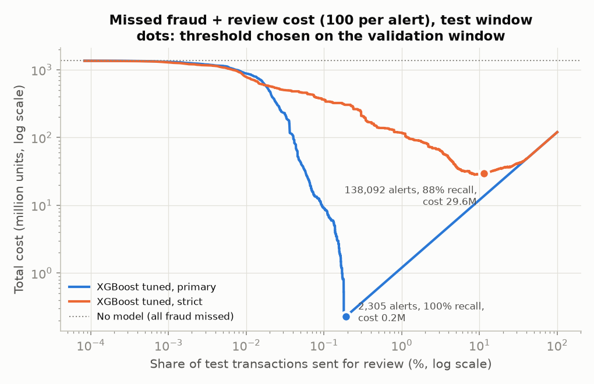
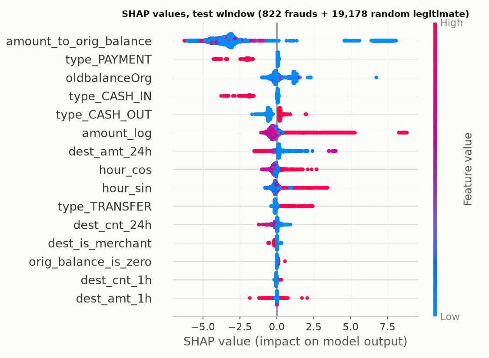
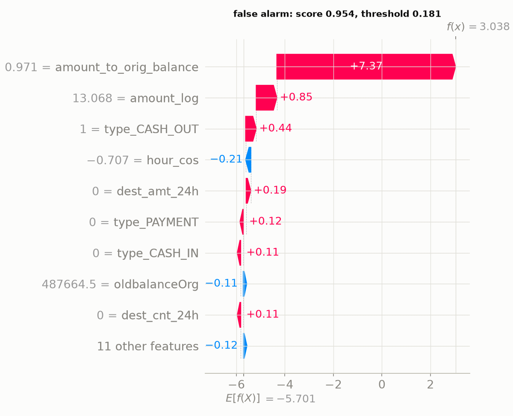

# Real-time payment fraud detection (UPI-style) on PaySim

A GPU-accelerated fraud-scoring pipeline for instant account-to-account
payments, built and evaluated on the public PaySim mobile-money dataset
(6.36M transactions). Dask preprocessing, leakage-free velocity features,
a time-ordered split, XGBoost on CUDA, Ray Tune with ASHA, MLflow tracking,
and SLURM scripts for a GPU cluster.

**Headline (held-out test window, days 14-16, 1.2M transactions, 822 frauds):**

| Model | Features | PR-AUC | Recall at precision 0.9 | Recall if top 0.5% is reviewed |
|---|---|---|---|---|
| XGBoost, GPU, tuned | primary: known at authorisation, incl. payer balance | **0.920** | 81.5% | 100% |
| XGBoost, GPU, tuned | strict: no balance columns at all | **0.380** | 28.0% | 52.7% |
| Logistic regression | primary | 0.160 | 0.1% | 56.8% |
| PaySim rule `isFlaggedFraud` | - | 0.002 | 0.1% | 0.9% |

With a review cost of 100 currency units per alert, the threshold chosen on
the validation window sends 0.19% of test transactions to review and catches
all 822 frauds (1.36 billion units at risk). That number reflects how
simulated fraud behaves; the strict model (88% recall for 11.5% of traffic
reviewed) is the more sober estimate of what transaction data alone can do.

The most important result is about honesty, not accuracy: the dataset's
post-transaction balance columns leak the label (PR-AUC 1.000 with them).
This project removes them, shows the leak in an ablation, and reports two
honest numbers: one with features a payer's bank knows at authorisation, and
a stricter one with no balance data at all.

---

## Contents

1. [Problem framing](#1-problem-framing)
2. [Dataset and provenance](#2-dataset-and-provenance)
3. [Pipeline](#3-pipeline)
4. [Features](#4-features)
5. [Balance leakage and the feature ablation](#5-balance-leakage-and-the-feature-ablation)
6. [Time-based split](#6-time-based-split)
7. [Models and tuning](#7-models-and-tuning)
8. [Results](#8-results)
9. [Design decisions](#9-design-decisions)
10. [Limitations](#10-limitations)
11. [Reproduce](#11-reproduce)
12. [Repository layout](#12-repository-layout)

---

## 1. Problem framing

UPI moves money between bank accounts in seconds, 24x7, and a completed push
payment is effectively irrevocable. Fraud therefore has to be stopped *before*
authorisation: the remitter (payer's) bank or PSP scores each payment within
the transaction's time budget and either lets it through, holds it for review
or step-up authentication, or declines it. The dominant fraud pattern is
account takeover and social engineering: the victim's account is drained to a
"mule" account, from which the money is withdrawn quickly.

Three properties drive every design choice here:

- **Extreme class imbalance.** 0.13% of PaySim transactions are fraud overall,
  0.07% in the test window. A model that never flags anything is 99.9% accurate,
  so accuracy and even ROC-AUC say little. The metrics used are PR-AUC, recall
  at a precision floor, recall under a fixed review budget, and money lost.
- **Time.** The model always scores the future, so it is trained on the past
  and tested on later days, never on a random shuffle.
- **Costs are asymmetric and amount-dependent.** Missing a 1M fraud is not the
  same as missing a 1k fraud; each alert costs analyst time. The operating
  threshold is chosen by minimising expected cost on the validation window.

## 2. Dataset and provenance

**PaySim** (E. A. Lopez-Rojas, A. Elmir, S. Axelsson, "PaySim: A financial
mobile money simulator for fraud detection", EMSS 2016) is an agent-based
simulator calibrated on one month of real transaction logs from a mobile-money
service in an African country. The Kaggle release (`ealaxi/paysim1`, licence
CC BY-SA 4.0) has 744 hourly steps and five transaction types.

| | |
|---|---|
| File | `PS_20174392719_1491204439457_log.csv` (493,534,783 bytes) |
| Source used | `https://huggingface.co/datasets/vitaliy-sharandin/synthetic-fraud-detection/resolve/main/PS_20174392719_1491204439457_log.csv` (public mirror, no login) |
| SHA256 | `16910f90577b0d981bf8ff289714510bb89bc71bff7d3f220f024e287e4eea6b` |
| Cross-check | An independent mirror (`theman10/paysim`, `paysim.csv`) has the identical SHA256 |
| Verified counts | 6,362,620 rows, 8,213 fraud (0.129%), 16 `isFlaggedFraud`; matches the Kaggle description. `src/ingest.py` stops if the counts differ. |

Fraud occurs only in `TRANSFER` (4,097) and `CASH_OUT` (4,116).

**Why PaySim is a reasonable proxy for UPI.** Both are retail, real-time,
account-to-account rails with person-to-person transfers (`TRANSFER`), merchant
payments (`PAYMENT`, P2M) and cash withdrawal (`CASH_OUT`). PaySim's fraud
agent takes over an account, transfers the balance to another account and
cashes out, which is the account-takeover and mule pattern behind most UPI
fraud. Timestamps are hourly, so daily cycles and short-window velocity can be
modelled.

**Why it is only a proxy.** It is simulated, not real UPI data, and calibrated
on one operator in one country. It has no device, IP, location, VPA, payee age,
merchant category or collect-request information, which real UPI models rely
on. Payers almost never repeat (6,353,307 distinct payers in 6.36M rows), so
payer history cannot be learned. Legitimate activity collapses after day 16
while fraud keeps arriving at about 250 per day. And the balance columns are
contaminated (section 5). Absolute scores here should not be read as what a
bank would see; the relative comparisons and the method are the point.

## 3. Pipeline



Every stage is one command (`python -m src.<stage>`), reads `config.yaml`, and
writes files, so any stage can be rerun alone. Data, models, the MLflow store
and Ray results live under `$FRAUD_WORK` (default `~/fraud_work`), never in
the repository.

## 4. Features

| Group | Feature | Why it should indicate fraud |
|---|---|---|
| base | `amount_log` | Fraud moves large sums (the whole balance). Log scale tames the heavy tail. |
| base | `type_*` (one-hot, 5) | Fraud only happens in transfers and cash-outs. |
| base | `hour_sin`, `hour_cos` | Genuine users sleep; scripted fraud does not. Sine and cosine of `step % 24` put 23:00 next to 00:00. |
| base | `dest_is_merchant` | Payee IDs starting with `M` are merchants; mules are person accounts. |
| velocity | `orig_cnt_{1h,24h}`, `orig_amt_{1h,24h}` | A taken-over account often makes a burst of payments. |
| velocity | `dest_cnt_{1h,24h}`, `dest_amt_{1h,24h}` | Mule accounts are fresh or suddenly busy. 72% of genuine transfers go to a payee seen in the previous 24 h, only 0.3% of fraudulent ones do. |
| payer balance | `oldbalanceOrg`, `amount_to_orig_balance`, `orig_balance_is_zero` | Account takeover drains the account: amount close to the full balance. The payer's bank knows this balance when it authorises. |
| post-txn balance (leaky) | `newbalanceOrig`, `oldbalanceDest`, `newbalanceDest`, `amount_to_dest_balance`, `orig_balance_error`, `dest_balance_error`, `dest_balances_both_zero` | Popular in public notebooks; in PaySim they encode what happened after the fraud decision. Used only to demonstrate the leak. |

**No look-ahead in velocity features.** For a transaction in hour *t*, the
*w*-hour window covers hours *t-w* to *t-1*. PaySim only records the hour, so
two payments in the same hour cannot be ordered; excluding the current hour
guarantees that no feature uses the future. The windows are computed with a
sweep line (each account-hour adds its count when it enters the window and
subtracts it when it leaves; a grouped cumulative sum gives the window total),
which needs only sort and prefix-sum and therefore also runs on the GPU.
`tests/test_features.py` checks it against a brute-force definition.

Payer windows are almost always empty here (0.02% of rows have any payer
history in 24 h) because PaySim payers rarely transact twice. They are kept
because they are standard and essential on real data, and the finding itself
is reported.

`day` (day index) is computed for splitting and analysis but not used as a
model input: under a time split every test day lies outside the training
range, so the model could only extrapolate from it.

## 5. Balance leakage and the feature ablation

The dataset authors state: *"Transactions which are detected as fraud are
cancelled, so for fraud detection these columns (oldbalanceOrg,
newbalanceOrig, oldbalanceDest, newbalanceDest) must not be used."*
Post-transaction balances record the outcome of the decision being modelled,
and features derived from them (balance "errors", payee balances both zero)
separate fraud almost perfectly. In UPI, moreover, the payer's bank cannot see
the payee's balance at all, because the payee usually banks elsewhere.

Two feature sets are therefore carried through tuning and evaluation:

- **primary** = base + velocity + payer balance: what a remitter bank knows at
  authorisation. It keeps the payer's pre-transaction balance, which the
  authors' note also covers; the reasoning is that a real bank does know it.
  Because PaySim's fraud agent always drains the account, this set is likely
  optimistic.
- **strict** = base + velocity: no balance column at all, as the authors
  advise. A conservative lower bound.

Ablation with identical default XGBoost hyperparameters (early stopping on
validation, then scored once on test):

| Feature set | Features | Val PR-AUC | Test PR-AUC | Test ROC-AUC | Test recall @ precision 0.9 | Trees |
|---|---|---|---|---|---|---|
| base | 9 | 0.331 | 0.362 | 0.947 | 26.3% | 91 |
| base + velocity (**strict**) | 17 | 0.314 | 0.350 | 0.959 | 25.7% | 119 |
| base + payer balance | 12 | 0.915 | 0.898 | 1.000 | 70.8% | 182 |
| base + velocity + payer balance (**primary**) | 20 | 0.924 | 0.912 | 1.000 | 79.6% | 159 |
| primary + post-transaction balances (leaky) | 27 | 0.999 | **1.000** | 1.000 | 100.0% | 15 |
| raw PaySim columns (typical notebook) | 10 | 0.914 | 0.913 | 1.000 | 77.9% | 219 |

Source: `results/ablation.csv`. Reading it:

- **The leak is unmistakable.** Adding post-transaction balances gives a
  perfect score on a future window after only 15 trees. Any result built on
  these columns measures the simulator's bookkeeping, not fraud.
- **The payer balance carries most of the remaining signal** (0.36 -> 0.90),
  because PaySim's fraud agent always tries to empty the account.
- **Velocity adds a little on top of the payer balance** (0.898 -> 0.912 test,
  0.915 -> 0.924 validation) but not on its own with default
  hyperparameters. Payee velocity separates fraud well for transfers (fresh
  mule accounts) but the base model already ranks most of those cases through
  type and amount, and payer velocity is empty in PaySim.
- **The raw columns alone score 0.913, not 1.0.** Trees cannot easily form
  the difference `old - amount - new`; the leak becomes perfect once the
  balance-error features are engineered, which is what many public notebooks
  do. A leak can hide in feature engineering, not only in raw columns.
- **The ROC-AUC column shows why it is not the headline metric:** 0.947 vs
  1.000 looks like a small step; the PR-AUCs, 0.36 vs 0.90, are far apart.

## 6. Time-based split

| Window | Steps (hours) | Days | Rows | Fraud | Fraud rate |
|---|---|---|---|---|---|
| train | 1-264 | 0-10 | 3,608,540 | 2,981 | 0.083% |
| validation | 265-336 | 11-13 | 1,176,235 | 786 | 0.067% |
| test | 337-408 | 14-16 | 1,202,642 | 822 | 0.068% |
| late period (stress test) | 409-743 | 17-30 | 375,203 | 3,624 | 0.966% |

A random split would train on transactions that happen after the test
transactions (for example later activity of the same mule account) and would
hide drift, giving optimistic scores. Validation is used for early stopping,
hyperparameter search and choosing the alert threshold; test is scored once.

**Why days 17-30 are not the test set.** In PaySim, legitimate traffic drops
from ~400k transactions a day to ~10-50k after day 16, while fraud stays at
~250 a day; the last day contains only fraud. That base-rate jump is an
artefact of the simulator, and testing there would inflate PR-AUC. The
boundary was set from daily volume before any model was trained, and the
late period is still scored and reported as a stress test (section 8.3).

## 7. Models and tuning

- **Rule baseline:** PaySim's `isFlaggedFraud`, documented as flagging attempts
  to transfer more than 200,000 at once. It fires on 16 of 6.36M rows.
- **Logistic regression:** balanced class weights; monetary features get a
  signed `log1p` and standardisation.
- **XGBoost on the GPU:** `tree_method="hist"`, `device="cuda"`,
  `QuantileDMatrix`, `scale_pos_weight` for imbalance, early stopping on
  validation PR-AUC.
- **Ray Tune + ASHA:** seeded random search over depth, learning rate,
  subsampling, `min_child_weight`, L2 penalty and the `scale_pos_weight`
  mode (`full` = n_neg/n_pos, `sqrt` = its square root). ASHA checks each
  trial's validation PR-AUC at 50, 150 and 450 boosting rounds and stops the
  bottom two thirds at each rung. Two trials share the 8 GB GPU. The best
  configuration is refit on the training window with early stopping.

Tuning outcome (64 configurations per feature set, `results/tune_trials_*.csv`,
`results/best_params.json`):

| Feature set | Search time | Val PR-AUC, defaults | Val PR-AUC, tuned | Best configuration |
|---|---|---|---|---|
| primary | 314 s | 0.924 | 0.932 | depth 5, lr 0.18, subsample 0.79, colsample 0.89, min_child_weight 1.1, lambda 0.18, `sqrt` weighting |
| strict | 319 s | 0.314 | 0.351 | depth 4, lr 0.17, subsample 0.87, colsample 0.70, min_child_weight 42, lambda 0.24, `sqrt` weighting |

- **ASHA did most of the saving.** In the primary search 47 of 64 trials were
  stopped at the first rung (50 rounds), 12 reached 150 rounds and only 5 went past it; all
  64 trials together used 5,476 boosting rounds, against up to 64,000 without
  early termination.
- **Tuning helps a little; the feature set matters far more** (+0.008
  validation PR-AUC from tuning vs +0.58 from adding the payer balance).
- **`sqrt` re-weighting beat full re-weighting** on average and in the best
  trial of both searches (mean validation PR-AUC 0.921 vs 0.898 for primary):
  weighting each fraud ~1,200 times pushes too many genuine transactions up
  the ranking; ~35 times is enough.
- **Two trials on one GPU did not raise throughput:** the trials' own run
  times add up to about the search's wall-clock, so one trial already keeps
  this GPU busy. More trials per hour needs more GPUs, which is what
  `slurm/tune_multi_gpu.sbatch` is for.

## 8. Results

All numbers are from one end-to-end run of `scripts/run_all.sh` with the
**pandas** DataFrame engine (see 8.6 for the cuDF path). Three small changes
were made after that run, none of which affects a metric: plot layout in
`evaluate.py` (the evaluation stage was rerun on the same models), keeping only
the latest run per name in `export_runs.py` (rerun), and a cuDF-compatibility
fix in the summary step of `ingest.py` (a no-op on the pandas path).

### 8.1 Test window (days 14-16: 1,202,642 transactions, 822 frauds, 0.068%)

| Model | PR-AUC | ROC-AUC | Recall @ precision 0.9 | Recall @ top 0.1% | Recall @ top 0.5% |
|---|---|---|---|---|---|
| XGBoost tuned, primary | **0.920** | 1.000 | 81.5% | 91.5% | 100.0% |
| XGBoost tuned, strict | **0.380** | 0.959 | 28.0% | 41.2% | 52.7% |
| Logistic regression, primary | 0.160 | 0.987 | 0.1% | 34.4% | 56.8% |
| Logistic regression, strict | 0.133 | 0.920 | 2.9% | 23.0% | 33.5% |
| XGBoost with post-txn balances (leaky, reference only) | 1.000 | 1.000 | 100.0% | 100.0% | 100.0% |
| Rule `isFlaggedFraud` | 0.002 | 0.501 | 0.1% | 0.4% | 0.9% |

"Top 0.1%" means the 1,203 highest-scored test transactions are reviewed;
ties (relevant for the 0/1 rule) are broken at random. The logistic regression
reaches ROC-AUC 0.987 yet PR-AUC 0.16, which is the imbalance problem in one
line.



### 8.2 Cost-based operating point

Total cost = 100 x (number of alerts) + (fraud amount not alerted). The
threshold minimising this on the **validation** window is applied unchanged to
the test window.

| Model | Threshold | Alerts on test | Share of traffic | Recall | Precision | Fraud missed | Total cost |
|---|---|---|---|---|---|---|---|
| XGBoost tuned, primary | 0.181 | 2,305 | 0.19% | 100.0% | 35.7% | 0.0M | 0.2M |
| XGBoost tuned, strict | 0.027 | 138,092 | 11.48% | 88.2% | 0.5% | 15.8M | 29.6M |
| Logistic regression, primary | 0.624 | 88,850 | 7.39% | 97.2% | 0.9% | 1.4M | 10.3M |
| Logistic regression, strict | 0.257 | 473,837 | 39.40% | 98.2% | 0.2% | 2.2M | 49.6M |
| Rule `isFlaggedFraud` | flag = 1 | 1 | 0.00% | 0.1% | 100.0% | 1,357.6M | 1,357.6M |
| No model | - | 0 | 0% | 0% | - | 1,362.5M | 1,362.5M |

Amounts are in PaySim's (unnamed) currency units. Because each fraud is large
relative to a review, the cost-optimal policy is to review generously; for the
strict model that means reviewing about one transaction in nine, which no real
operations team could staff, so in practice it would run with an alert budget
instead (row "top 0.5%" in 8.1).

Sensitivity of the primary model's operating point to the assumed review cost
(threshold re-chosen on validation for each cost):

| Review cost per alert | Alerts on test | Share of traffic | Recall | Precision | Total cost |
|---|---|---|---|---|---|
| 10 | 2,305 | 0.19% | 100.0% | 35.7% | 0.02M |
| 100 | 2,305 | 0.19% | 100.0% | 35.7% | 0.23M |
| 1,000 | 2,305 | 0.19% | 100.0% | 35.7% | 2.31M |
| 10,000 | 1,214 | 0.10% | 91.6% | 62.0% | 20.94M |



### 8.3 Late-period stress test (days 17-30)

375,203 transactions, 3,624 frauds (0.97%, 14x the test-window rate).

| Model | PR-AUC | ROC-AUC | Recall @ precision 0.9 |
|---|---|---|---|
| XGBoost tuned, primary | 0.988 | 1.000 | 98.4% |
| XGBoost tuned, strict | 0.441 | 0.950 | 15.6% |

The ranking quality holds up when genuine traffic collapses (ROC-AUC is
unchanged). PR-AUC rises for the primary model mostly because the base rate
is 14x higher, which is exactly why this window is not mixed into the test set.

### 8.4 Explanations (SHAP)

Exact TreeSHAP values from XGBoost (`pred_contribs=True`) on all 822 test
frauds plus 19,178 random genuine test transactions (fraud-enriched so that
fraud points are visible; `results/shap_importance.csv`).



`amount_to_orig_balance` dominates: a payment that empties the payer's
account is the signature of the simulated account takeover. Transaction type
comes next (`PAYMENT` and `CASH_IN` are never fraud), then amount and the
payer balance. Payee activity (`dest_amt_24h`) and time of day contribute at
the margin.

Local explanations (`results/metrics.json` -> `shap.local_explanations`):

| Case | Transaction | Score | What drove it |
|---|---|---|---|
| Most confident catch | CASH_OUT of 1.74M | 0.9998 | amount / balance (+6.8 log-odds), large amount (+4.2) |
| Hardest fraud (lowest score) | CASH_OUT of 49k | 0.487 | drains the account (+6.9), pulled down by the small amount (-0.6) and the time of day (-0.4); still above the 0.181 threshold |
| Most confident false alarm | CASH_OUT of 473k | 0.954 | a genuine customer withdrawing 97% of the balance (+7.4) |

The false alarm shows the model's blind spot in plain terms: on transaction
data alone, a genuine customer emptying their account looks like a takeover.
Device and login signals are what separate the two in practice.



### 8.5 Hardware and wall-clock

Laptop: NVIDIA RTX 3070 Ti Laptop GPU (8 GB, driver 610.62), Intel Core
i7-12650H (16 threads), WSL2 Ubuntu 24.04 with 7.7 GB RAM, Python 3.12.3
(`results/environment.json`). Per-stage wall-clock from `results/timings.json`:

| Stage | Wall-clock |
|---|---|
| tests (window features) | 2 s |
| ingest: CSV -> Parquet (Dask, pandas engine) | 19 s |
| features: two shuffles + windows + row features (Dask, pandas engine) | 72 s |
| split | 15 s |
| baselines (rule, 2 x logistic regression) | 34 s |
| XGBoost ablation (6 feature sets, GPU) | 60 s |
| Ray Tune + ASHA, primary set (64 trials) | 314 s |
| refit best, primary | 21 s |
| Ray Tune + ASHA, strict set (64 trials) | 319 s |
| refit best, strict | 21 s |
| evaluate (metrics, cost, SHAP, figures) | 21 s |
| **end to end, `scripts/run_all.sh`** | **965 s (16 min)** |

Across three runs, ingest took 9-19 s and features 57-83 s; the slower figures
were measured while a large package install was running in the background.
All model metrics were identical across the two full runs (seeded XGBoost
and seeded search).

XGBoost GPU vs CPU on the same fit (training window, primary features, 300
rounds, no early stopping; `python -m src.benchmark`): **6.6 s on the GPU vs
169.9 s on 16 CPU threads, a 25.7x speed-up** (`results/gpu_vs_cpu.json`).

### 8.6 cuDF path

The preprocessing stages were also run with `--engine cudf` (RAPIDS cuDF
26.02, separate environment) on the same machine, and the outputs were
compared column by column with `scripts/compare_feature_outputs.py`:
all 36 columns of all 6,362,620 rows agree (`results/engine_comparison.json`).

| Stage | pandas engine | cuDF engine |
|---|---|---|
| ingest | 8.1 s | 4.8 s (8.8 s on the first, cold run) |
| features | 53.6 s | 31.9 s (34.7 s cold) |

These pandas timings were taken on an idle machine, unlike the end-to-end
table above. The speed-up is modest because the job is small and partly I/O-
and shuffle-bound; it would grow with data size. **Every model number in this
README comes from the pandas-engine features.** Since the cuDF features are
identical, the downstream results would be too, but they were not rerun from
the cuDF output.

### 8.7 Cluster run (SLURM)

Both SLURM templates were run on a national HPC system's GPU partition: nodes with 2x
NVIDIA A100 80GB PCIe, 2x Intel Xeon Gold 6240R (48 cores), 192 GB RAM and
InfiniBand, RHEL 9 family, driver 590.48. Same pinned packages
(`requirements.txt`, Python 3.12) in a venv on the shared parallel
filesystem, which also held the data, MLflow store and Ray results; the
dataset was downloaded and checksummed on a login node. Outputs (CSV and
JSON only) are in `results/cluster/`. The laptop numbers above remain the
primary results.

**Single-GPU pipeline** (`slurm/pipeline_single_gpu.sbatch`: 1 A100, 16
cores, 48 GB; `results/cluster/pipeline/`):

| Stage | Laptop (RTX 3070 Ti, 7.7 GB RAM) | Cluster node (1x A100, 16 cores) |
|---|---|---|
| ingest (Dask, pandas engine) | 19 s | 8 s |
| features | 72 s | 18 s |
| split | 15 s | 12 s |
| baselines | 34 s | 29 s |
| XGBoost ablation (6 fits) | 60 s | 38 s |
| Ray Tune + ASHA, primary (64 trials, 2 per GPU) | 314 s | 523 s |
| refit best, primary | 21 s | 15 s |
| Ray Tune + ASHA, strict (64 trials, 2 per GPU) | 319 s | 500 s |
| refit best, strict | 21 s | 15 s |
| evaluate | 21 s | 24 s |
| **end to end** | **965 s** | **1,278 s** (job time, incl. tests and checksum) |

- **Metrics match the laptop run.** Every XGBoost number is identical: the
  ablation table (same best iterations, same validation and test metrics),
  both searches (all 64 trials of each got the same score and ran the same
  number of rounds, so ASHA stopped the same trials), the best
  configurations, the test-window metrics, the late-period metrics and the
  SHAP importances. XGBoost's GPU `hist` method sums gradients in fixed
  point, so a different GPU builds the same trees, and the search is
  seeded. The only differences are in the logistic regression baselines,
  in the fifth significant digit (test PR-AUC 0.16003 vs 0.16007, primary),
  from floating-point summation order in the CPU solver on a different CPU.
- **Data stages and single fits were faster** (more cores, and 48 GB
  instead of the laptop's 7.7 GB; the idle-laptop pandas figures in 8.6 are
  closer: 8 s and 54 s).
- **Tuning was 1.6x slower.** The trials themselves took about as long as on
  the laptop (their own run times add up to 350 s vs 324 s for the primary
  search; a trial is a few seconds of work, too small to benefit from an
  A100), but each trial spent ~11 s per slot outside its own run time
  against ~5 s on the laptop. The likely cause is per-trial start-up: every
  trial is a fresh Ray worker process that imports XGBoost, pandas and Ray
  from the venv on the shared parallel filesystem, and Tune writes its
  result files there; this was not profiled further.

**Multi-node Ray Tune** (`slurm/tune_multi_gpu.sbatch`): the same 128
configurations of the primary search (seed 42, ASHA), one trial per GPU with
8 cores each, Ray head plus one worker per extra node, 32 cores and 2 GPUs
per node (`results/cluster/tune_scaling.csv`):

| Nodes | GPUs | Wall-clock, 128 trials | Trials/min | Speed-up | GPU busy share | Best val. PR-AUC | Test PR-AUC (refit) |
|---:|---:|---:|---:|---:|---:|---:|---:|
| 1 | 2 | 990 s | 7.8 | 1.00x | 36% | 0.9327 | 0.918 |
| 2 | 4 | 527 s | 14.6 | 1.87x | 38% | 0.9327 | 0.918 |
| 4 | 8 | 278 s | 27.6 | 3.54x | 37% | 0.9327 | 0.918 |

- **Throughput scales close to linearly.** Four times the GPUs gives 3.54x
  the trials per minute (89% scaling efficiency); the shortfall is likely the
  fixed cost of starting Ray on each node and the last few trials finishing on a
  partly idle cluster.
- **The GPUs are mostly idle.** A trial is only a few seconds of GPU work, so
  per-trial overhead (a fresh worker process importing
  XGBoost, pandas and Ray from the shared filesystem, plus result writes)
  dominates: summed trial time is only ~37% of GPUs x wall-clock at every
  node count. Adding nodes adds trial slots, which is why throughput still
  scales. Packing trials helps here: the single-GPU pipeline job ran 2
  trials per A100 and reached 7.3 trials/min (64 in 523 s), close to the
  7.8 of one trial on each of 2 GPUs, so per-GPU throughput nearly doubles
  (on the laptop GPU it gave no gain).
- **Same answer at every scale.** ASHA is asynchronous, so which trials it
  stops depends on when results arrive: total boosting rounds differ
  (10,464 to 11,549). All three runs still found the same best
  configuration (validation PR-AUC 0.9327). Its test PR-AUC, 0.918, is a
  little below the laptop's 64-trial best (0.920): a higher validation score
  did not carry over, which is within the noise one expects at this level, so
  the laptop model stays the headline result.
- **Cost:** 1.46 node-hours for all four jobs (`results/cluster/jobs.csv`).
  A first 4-node attempt in the large-job queue never started: that queue
  requires at least 5 nodes, so the run used the debug queue (up to 4 nodes,
  1 hour).

**Template fixes found on the cluster** (all in the committed scripts):

- Multi-node: the GPU count per node was hard-coded to 4 (the nodes have 2),
  so Ray would have handed trials GPU ids that do not exist; it now comes from
  SLURM. Whether `srun` inherits `--cpus-per-task` from `sbatch` depends on the
  SLURM version (without it each Ray node could be pinned to one core), so it
  is now passed explicitly.
- Multi-node: fixed 30 s sleeps replaced by polling until every GPU has
  registered with the Ray head; a job-specific port instead of 6379; the head
  address from the name the other nodes resolve.
- Multi-node: `ray stop` at the end kills every Ray process of the same user
  on the node, including other jobs' on a shared node; the script now stops
  only its own Ray steps, also on failure (`trap`). The Ray steps do not exit
  within 30 s of SIGTERM, so they are then killed and SLURM logs them as
  cancelled; the job itself completes normally.
- Multi-node: arguments after the script name now reach `tune.py`, so node
  count and trial budget can change without editing the file.
- `tune.py`: without a `--ray-address` it now starts a private Ray instance
  (`address="local"`); before, `ray.init()` joined any Ray cluster it found
  running on the node.
- Single-GPU: `download_data.sh || echo ...` hid a failed checksum and went
  on with a corrupt CSV; the job now stops if the file is missing or does not
  verify.
- Both: no site-specific scratch default; `FRAUD_WORK` must be set (sbatch
  passes it to the job), and the wall-clock limits match the measured times.
  Ray 2.59 enables token authentication by default and writes the token to
  `~/.ray/auth_token`; on a shared home, `RAY_AUTH_TOKEN_PATH` keeps it
  elsewhere.

## 9. Design decisions

| Decision | Why | Alternatives considered |
|---|---|---|
| PaySim | Only public dataset that resembles account-to-account mobile payments with transaction types, timestamps and accounts. | ULB credit-card (PCA features, cards, 2 days), IEEE-CIS (card-not-present, needs login), self-made synthetic data. |
| Time-based split, late period held apart | Matches deployment; avoids leakage through time; keeps the base rate realistic. | Random or stratified split, k-fold CV (both leak); walk-forward evaluation (better, k times the compute; natural next step). |
| Features grouped by what the bank knows at authorisation | Makes leakage a visible, testable property instead of a hidden one. | Using all columns (PR-AUC 1.0, meaningless). |
| Velocity via shuffle-by-account + sweep line | Exact, no look-ahead, O(n log n), uses only sort and prefix sums so it also runs on cuDF. | `groupby().rolling()` (pandas only, slow on millions of tiny groups), self-join (quadratic). |
| Dask + Parquet | Out-of-core, parallel, same functions on pandas or cuDF partitions, runs unchanged on a cluster. | Plain pandas (single core, memory-bound), Spark (JVM, heavier on SLURM), Polars (no distributed GPU path). |
| XGBoost `hist` on CUDA | Strongest family for tabular data; GPU makes each fit a few seconds, so a real search is affordable. | Random forest, LightGBM, CatBoost (comparable), deep tabular nets, graph neural networks (good for mule rings, but PaySim's graph is too sparse to justify). |
| Re-weighting, not resampling | Changes the loss without inventing transactions; oversampling before a time split is a common leakage bug. | SMOTE, random under/oversampling. |
| Random search + ASHA | Cheap trials (seconds) and few important parameters favour random search; ASHA spends compute on promising trials and parallelises without waiting. | Grid search, Bayesian optimisation (TPE / BOHB: better for expensive trials), synchronous Hyperband. |
| PR-AUC, recall at precision, recall at budget, cost | Reflect how fraud teams operate: limited analysts, money at risk. | Accuracy, ROC-AUC alone (look excellent for weak models at 0.07% prevalence). |
| Threshold chosen on validation by cost | Decision theory with an amount-dependent loss; never tuned on test. | Fixed 0.5 (meaningless with re-weighting), F1-optimal threshold (ignores amounts and review cost). |
| SHAP from XGBoost (`pred_contribs`) | Exact TreeSHAP computed by the booster itself, on the GPU, consistent with the model version. | Permutation importance (global only), gain importance (biased to high-cardinality splits). |
| MLflow with a SQLite store under `$FRAUD_WORK` | Local, single file, queryable; nothing large in the repository. | MLflow file store (deprecated in MLflow 3), hosted trackers (need accounts). |
| Linux venv (WSL2) with pinned wheels | Same code and packages as a Linux SLURM node; RAPIDS is Linux-only. | Native Windows Python (different wheels, no cuDF). |

## 10. Limitations

- **Simulated data.** PaySim mimics one operator's logs; real UPI fraud is more
  varied (collect-request scams, QR-code swaps, SIM swap, remote-access apps)
  and real features (device, network, payee age, complaint history) are
  missing. The strict model is the more realistic estimate of what transaction
  data alone can do.
- **Simulator artefacts.** The fraud agent always drains the account and many
  simulated genuine payers have zero or insufficient balance, which makes
  `amount_to_orig_balance` unrealistically decisive. Payers almost never
  repeat, so payer velocity is uninformative here.
- **Single time split.** One train/validation/test cut; a walk-forward
  evaluation over several cut-offs would give confidence intervals.
- **Immediate labels.** Real fraud labels arrive days to weeks later
  (complaints, chargebacks). Production training needs a label-delay gap.
- **Uncalibrated scores.** `scale_pos_weight` distorts probabilities; ranking
  and thresholds are unaffected, but probability estimates would need Platt or
  isotonic calibration on validation.
- **Review cost is an assumption** (100 units per alert); section 8.2 shows how
  the operating point moves for other values. Customer friction from false
  declines is not priced in.
- **Hour resolution.** Same-hour history is excluded to avoid look-ahead; with
  real timestamps the windows would be sharper.
- **Cluster runs are few.** Each SLURM template ran on one site (section 8.7),
  once per configuration. Other sites need their own partition and account
  values and may schedule differently (QoS minimums, srun defaults).

## 11. Reproduce

### Local (Linux or WSL2 with an NVIDIA GPU)

```bash
# 1. Environment (Python 3.12). uv needs no root; plain venv + pip also works.
curl -LsSf https://astral.sh/uv/install.sh | sh
export FRAUD_WORK=~/fraud_work                 # large files go here, not in the repo
uv venv --python 3.12 "$FRAUD_WORK/.venv"
source "$FRAUD_WORK/.venv/bin/activate"
uv pip install -r requirements.txt

# 2. Data: downloads from the public mirror and verifies the SHA256
bash scripts/download_data.sh

# 3. Everything: tests, ingest, features, split, baselines, ablation,
#    tuning (both feature sets), evaluation, MLflow export
bash scripts/run_all.sh --engine pandas

# Optional: browse the runs
mlflow ui --backend-store-uri "sqlite:///$FRAUD_WORK/mlflow/mlflow.db"
```

Single stages: `python -m src.features --engine pandas`, `python -m src.tune
--feature-set strict --num-samples 32 --gpus-per-trial 1`, and so on. Every
stage accepts `--config path/to/config.yaml`.

### SLURM GPU cluster

Edit `<partition>` and `<account>` in the scripts, then from the repository
root on a login node:

```bash
export FRAUD_WORK=<fast shared storage>/fraud_work   # visible from every compute node
uv venv --python 3.12 "$FRAUD_WORK/.venv" && source "$FRAUD_WORK/.venv/bin/activate"
uv pip install -r requirements.txt
bash scripts/download_data.sh                   # login nodes usually have internet

sbatch slurm/pipeline_single_gpu.sbatch          # full pipeline on one GPU
sbatch --nodes=4 slurm/tune_multi_gpu.sbatch --num-samples 128   # one trial per GPU across nodes
```

sbatch passes the shell's environment (`FRAUD_WORK`, optionally
`FRAUD_RESULTS`) to the job. Arguments after the multi-node script go to
`tune.py`, which takes `--num-samples`, `--gpus-per-trial`, `--cpus-per-trial`,
`--time-budget-s` and `--ray-address` (the script starts a Ray head and one
worker per extra node, waits until all GPUs have registered, and passes the
head address).

### Optional cuDF path

RAPIDS pins its own pandas and Dask versions, so it goes into a separate
environment:

```bash
uv venv --python 3.12 "$FRAUD_WORK/.venv-rapids" && source "$FRAUD_WORK/.venv-rapids/bin/activate"
uv pip install "cudf-cu12==26.2.1" "dask-cudf-cu12==26.2.1" pyyaml
python -m src.ingest --engine cudf
python -m src.features --engine cudf
```

`--engine auto` uses cuDF when it can be imported and falls back to pandas
otherwise. Verified with cudf 26.02.01, dask 2026.1.1 and pandas 2.3.3 in that
environment (the later stages need the main environment). To compare the two
engines, write the cuDF output elsewhere with `FRAUD_WORK=... FRAUD_RESULTS=...`
and run `python scripts/compare_feature_outputs.py <pandas features dir> <cudf features dir>`.

## 12. Repository layout

```
config.yaml              all settings: paths, windows, split, feature groups, model, tuning, evaluation
src/
  common.py              config, paths, timing, MLflow setup
  backend.py             pandas / cuDF switch for Dask partitions
  ingest.py              stage 1: CSV -> Parquet, dataset checks
  features.py            stage 2: velocity (sweep line) and row features
  split.py               stage 3: time-based split
  baselines.py           stage 4: isFlaggedFraud rule, logistic regression
  train.py               stage 5: XGBoost on GPU, feature ablation
  tune.py                stage 6: Ray Tune + ASHA, refit of the best configuration
  evaluate.py            stage 8: test metrics, cost threshold, SHAP, figures
  metrics.py             PR-AUC, recall at precision / budget, cost curve
  export_runs.py         MLflow runs summary and environment record
  benchmark.py           optional: same XGBoost fit on GPU vs CPU
tests/test_features.py   window features vs brute force, no same-hour look-ahead
scripts/                 download_data.sh, run_all.sh, compare_feature_outputs.py (pandas vs cuDF check)
slurm/                   single-GPU pipeline, multi-GPU Ray Tune
results/                 metrics.json, ablation.csv, tune_trials_*.csv, best_params.json,
                         mlflow_runs.csv, data_summary.json, timings.json, environment.json,
                         gpu_vs_cpu.json, shap_importance.csv, figures/*.png
results/cluster/         SLURM runs: pipeline/, tune_{1,2,4}node/, tune_scaling.csv, jobs.csv
```

## Licence and citation

Code: MIT (see `LICENSE`). Data: PaySim, CC BY-SA 4.0, not redistributed here.
If you use the data, cite: E. A. Lopez-Rojas, A. Elmir, S. Axelsson, "PaySim:
A financial mobile money simulator for fraud detection", 28th European
Modeling and Simulation Symposium (EMSS), Larnaca, Cyprus, 2016.
